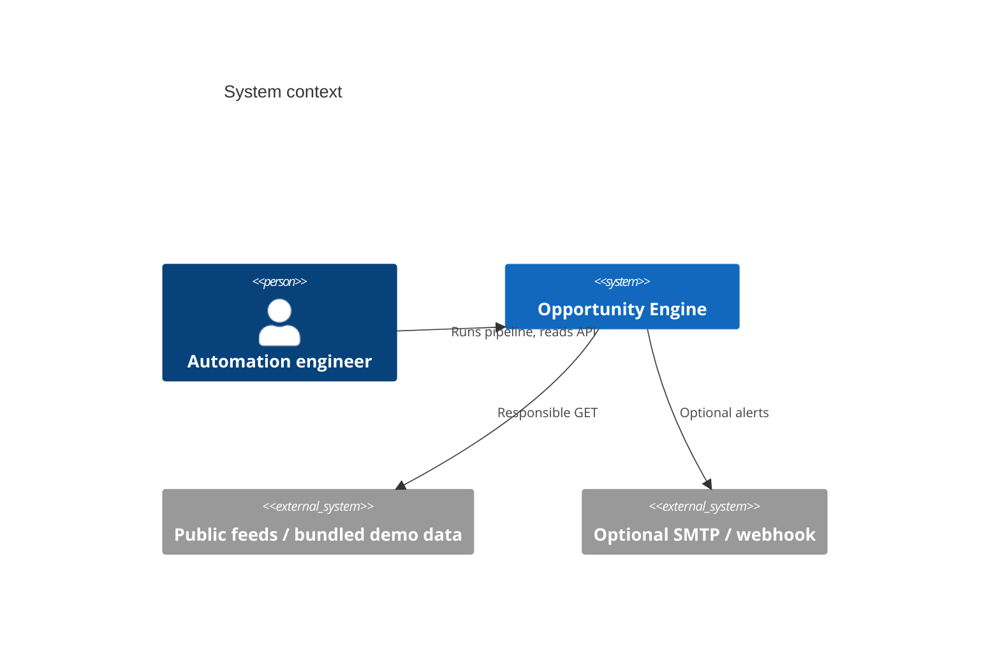

# Architecture

## System context

Opportunity Engine is a single Python service. Operators run it from the CLI, a scheduler (Prefect or cron), or Docker. Consumers read scored opportunities through FastAPI, a Jinja dashboard, or exported workbooks.

## Components

- **Connectors** — `OpportunitySource` implementations
- **Pipeline** — async orchestrator with source isolation
- **Repositories** — SQLAlchemy persistence
- **Scoring / deadlines / dedupe / change detection** — pure-ish domain services
- **Reporting** — openpyxl + CSV/JSON
- **Notifications** — console always; email/webhook optional
- **API + dashboard** — FastAPI

## Data flow

See the README mermaid chart. Provenance path: `raw_opportunities.id` ← `opportunities.raw_opportunity_id`.

## Database architecture

Tables: `sources`, `raw_opportunities`, `opportunities`, `opportunity_history`, `duplicate_candidates`, `automation_runs`, `automation_run_steps`, `ingestion_errors`, `notifications`, `exports`.

Money columns are `Numeric(18, 2)`. Identifiers are UUIDs. Common filters are indexed (`score`, `deadline_at`, `status`, `content_hash`, `canonical_url`).

## Connector architecture

`config/sources.yaml` is validated with Pydantic. Disabled remote examples document how a live JSON source would be declared. HTTP uses shared timeouts, exponential backoff, rate limiting and optional robots.txt checks. There is no proxy rotation or anti-bot evasion.

## Workflow orchestration

`OpportunityPipeline.run()` is the system of record. Prefect flow `opportunity_pipeline` calls it. Tests and `opportunity-engine demo` never start a Prefect API.

## Failure boundaries

| Boundary | Behaviour |
| --- | --- |
| Source fetch | Isolated; other sources continue |
| Single record | Validation errors → `ingestion_errors` |
| Database catastrophe | Session rollback; run marked `failed` |
| Reporting | Run can still succeed as `partial` if export fails |
| Notifications | Console still records attempts |

## Transaction strategy

One invalid record must not destroy a source batch: record failures are written and processing continues. The session commits at the end of a successful or partial run. A raised persistence exception rolls back the unit of work.

## Configuration management

`pydantic-settings` for environment. YAML for source topology and scoring weights. Changing weights does not require a deploy of Python code if the file is mounted.

## Observability

structlog with `run_id`, `source`, `task`, `duration_ms`, `status`, `error_type`. Secrets redacted. Run metrics JSON is stored on `automation_runs`.

## Security boundaries

No credentials required for demo. Optional SMTP password and webhook URL stay in env. Outbound HTTP should be allow-listed in production.

## Deployment model

- Local: SQLite file under `data/`
- Docker Compose: API + PostgreSQL
- CI: lint, mypy, pytest, docker build

## Technology decisions and tradeoffs

Documented in `docs/decisions/`. Summary: prefer a clear small production architecture over an enterprise service mesh. Prefer explainable scoring over a model. Prefer SQLite demos over forcing Docker for the first run.
