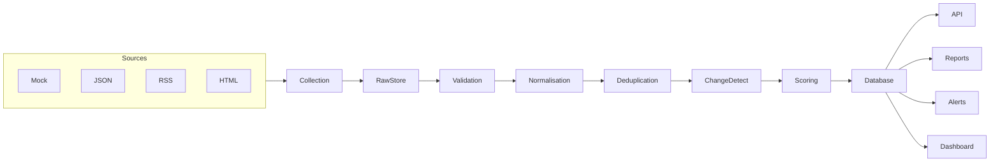

# Opportunity Intelligence Automation Engine

Collect, normalise, score and report commercial opportunities from multiple sources — without an LLM.

See [FAILURES.md](./FAILURES.md) for what can go wrong, what broke, how it was fixed, and results.

[](https://www.python.org/)
[](./tests)
[](./pyproject.toml)
[](./docker-compose.yml)

Self-directed engineering case study. Not a client commission.

## Problem

Procurement, freelance and supplier opportunities are scattered across feeds and websites. Manual monitoring produces stale spreadsheets, missed deadlines and duplicated rows with no audit trail.

## Solution

`OpportunityEngine` is a small production-style Python automation system:

1. Collect from mock, JSON, RSS and HTML connectors (Playwright optional).
2. Store raw payloads for provenance.
3. Validate and normalise inconsistent fields.
4. Deduplicate with an explicit `AMBIGUOUS` state.
5. Detect field-level changes on re-ingestion.
6. Score 0–100 with persisted reasons.
7. Classify deadline urgency.
8. Export Excel / CSV / JSON, emit notifications, expose a FastAPI API and a Jinja dashboard.
9. Record run history and source health.

The pipeline is fully deterministic. Optional enrichment adapters exist but are disabled by default.

## Key Features

- Multi-source collection with per-source failure isolation
- Responsible HTTP client (timeouts, retries, rate limits, User-Agent, robots.txt)
- Raw + normalised persistence
- Explainable scoring via `config/scoring.yaml`
- Idempotent re-runs
- Change history
- Prefect 3 wrapper (CLI does not need a Prefect server)
- SQLite for local demo, PostgreSQL for production

## Architecture



See [ARCHITECTURE.md](ARCHITECTURE.md) and [CASE_STUDY.md](CASE_STUDY.md).

## Pipeline

Collection → raw store → validation → normalisation → fingerprints → deduplication → change detection → scoring → deadline urgency → persistence → reports → notifications → run metrics.

Independent sources run concurrently. One failed source does not abort the others.

## Technology Stack

Python 3.12, FastAPI, Pydantic, SQLAlchemy 2, Alembic, PostgreSQL / SQLite, httpx, BeautifulSoup, optional Playwright, Prefect 3, openpyxl, Jinja2, pytest, Ruff, mypy, structlog, tenacity, Docker, uv.

## Quick Start

Windows (PowerShell) and Unix:

```bash
cp .env.example .env
uv sync --group dev
uv run alembic upgrade head
uv run opportunity-engine demo
uv run pytest
uv run opportunity-engine api
```

If `make` is available: `make install`, `make demo`, `make test`, `make api`.

Open:

- Dashboard: http://127.0.0.1:8000/
- OpenAPI: http://127.0.0.1:8000/docs


*Add a screenshot of the dashboard after the first local demo if you publish this repository.*

## Demo

```bash
uv run opportunity-engine demo
uv run opportunity-engine demo              # idempotent — counts must not double
uv run opportunity-engine demo --apply-updates
uv run python scripts/run_case_study_demo.py
```

Bundled synthetic data is fictional (Northbridge Digital Services, Eastmere Borough Services, and similar). No external credentials are required.

## API

| Method | Path | Purpose |
| --- | --- | --- |
| GET | `/health` | Liveness |
| GET | `/health/ready` | Database readiness |
| GET | `/metrics/summary` | Operations snapshot |
| GET | `/api/v1/opportunities` | Filtered, paginated list |
| GET | `/api/v1/opportunities/top` | Highest scores |
| GET | `/api/v1/opportunities/closing-soon` | Urgent deadlines |
| GET | `/api/v1/opportunities/new` | Recently first seen |
| GET | `/api/v1/opportunities/{id}` | Detail + score reasons |
| GET | `/api/v1/sources` | Connector health |
| GET | `/api/v1/runs` | Automation history |
| POST | `/api/v1/runs` | Trigger a run |
| POST | `/api/v1/exports` | Excel / CSV / JSON |

Filters include `min_score`, `keyword`, `organisation`, `category`, `status`, `rating`.

## CLI

```bash
uv run opportunity-engine run
uv run opportunity-engine run --source demo
uv run opportunity-engine sources
uv run opportunity-engine health
uv run opportunity-engine export --format xlsx
uv run opportunity-engine export --format csv
uv run opportunity-engine opportunities --top 20
uv run opportunity-engine metrics
uv run opportunity-engine db upgrade
uv run opportunity-engine demo
uv run opportunity-engine api
```

## Configuration

- Environment: `.env.example`
- Sources: `config/sources.yaml`
- Scoring weights: `config/scoring.yaml`

SMTP and `WEBHOOK_URL` are optional. Console notifications always work.

## Testing

```bash
uv run pytest
uv run pytest --cov=app --cov-report=term-missing
uv run ruff check app tests scripts
uv run ruff format --check app tests scripts
uv run mypy app
```

CI does not call random external websites. HTTP behaviour is mocked with `respx`.

## Docker Deployment

```bash
docker compose up --build
```

Starts PostgreSQL and the API. Apply migrations as part of the app command. Keep remote sources disabled unless the target permits automation.

## Project Structure

```text
app/            API, CLI, dashboard, pipeline, sources, services
config/         Source and scoring YAML
data/demo/      Bundled synthetic feeds
migrations/     Alembic
tests/          Unit, integration, e2e
scripts/        Case-study demo and benchmark
docs/decisions/ ADRs
```

## Engineering Decisions

- Pipeline service first; Prefect is a wrapper
- Raw records are retained
- Uncertain duplicates are not auto-merged
- Money uses `Decimal` / `Numeric`
- Scraping is limited to public, permitted collection

## Limitations

- Demo HTML/RSS/JSON connectors read local fixtures, not live portals
- Playwright is optional and unused in CI
- Email/webhook delivery needs operator credentials
- SQLite is for local demo, not concurrent production load
- Fuzzy matching is conservative by design

## Future Improvements

- Partial unique indexes on PostgreSQL
- Review UI for `AMBIGUOUS` pairs
- Object storage for large raw HTML
- Allow-listed live sources with recorded permission

## License

MIT. See [LICENSE](LICENSE).
